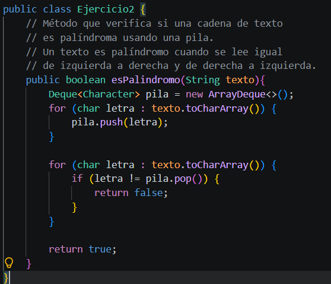

# Practica: Dinamicas Lineales en Java

## Datos del Estudiante
- **Nombre:** Ricardo Emilio Uzhca Benavides
- **Curso:** Grupo 1
- **Fecha:** 08/06/02026

---

**Fecha:** 08/06/2026

**Descripcion:**

En esta seccion se implementaran las siguientes estrucutras dinamicas lineales

- Listas enlazadas con LinkedList
- Pilas con Stack y Deque
- Colas con Queue

Implementar un método que reciba una cadena de texto y devuelva la misma cadena invertida.

Ejercicio 1: Invertir un String utilizando una pila

---

**Fecha:** 10/06/2026

**Descripcion:**
Se implementó un método que utiliza una pila para invertir una palabra y compararla, si ambas son iguales, la palabra es palíndroma y retorna true sino retorna false

Ejercicio 2: Ejercicio Palindromo

Metodo implementado:

